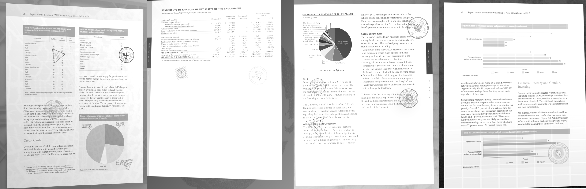
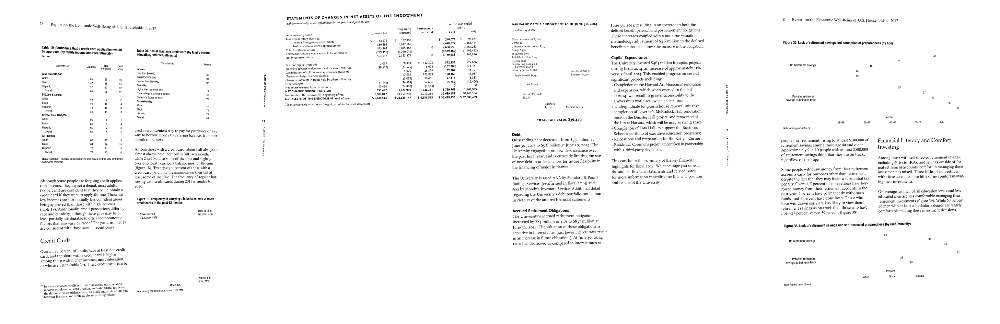

## Description

The total dataset can be downloaded from [this link](https://drive.google.com/drive/folders/15L14KyFoUHAqV_f1Jn-u20YYEYVH5u8Z?usp=sharing) (~300Gb)

Dataset might be slightly different from one presented in article, since we are continuing to revise and improve it. The latest version is 1.4.

To facilitate downloading we devided dataset into 33 parts.




## Dataset Description

Dataset is splited into 33 parts. Every part corresponds to a single book.
Every book folder incudes following:
1. original pdf file. (```<name>.pdf```)
2. original backgrounds as pdf book and as set of images (```orig_backgrounds.pdf, orig_backgrounds/*.png```)
3. original masks as pdf book and as set of grayscale images (```orig_masks.pdf, orig_masks/*.png```)
4. original text as pdf book and as set of grayscale images (```orig_texts.pdf, orig_texts/*.png```)
5. original boxes as set of pickle files (```orig_boxes/*.pkl```)
6. generated page images (```gen_imgs/*.png```)
7. generated boxes (```gen_boxes/*.pickle```)
8. generated masks (```gen_masks/*.png```)

# Naming
Original images and boxes are numerated in pdf order.

For every origin page some images with different distortions are generated. This is marked by adding underscore followed by number to the original page name.

For example page number 12 is presented in dataset as "orig_imgs/12.png", its original boxes is in "orig_boxes/12.pkl". FIrst 2 distorted images of the page are "gen_imgs/12_0.png", "gen_imgs/12_1.png" and corresponding boxes are "gen_boxes/12_0.pickle", "gen_boxes/12_1.pickle". Masks obey the same naming rule with addition of "\_{n}", where n means mask number since more then one mask is created for every image. 0 mask corresponds to text, 1 mask - stamps.

# Box format
Pickle file for every page represents python object with following structure:
```
[
  {
    'text': str (string representation of word),
    'box': np.array (numpy array with shape (4, 2) - coordinates of 4 corners),
    'chars': [
        {
          'text': str (single symbol),
          'box': np.array (numpy array with shape (4, 2) - coordinates of 4 corners)
        },
        ...
      ]
   },
   ...
]
```
